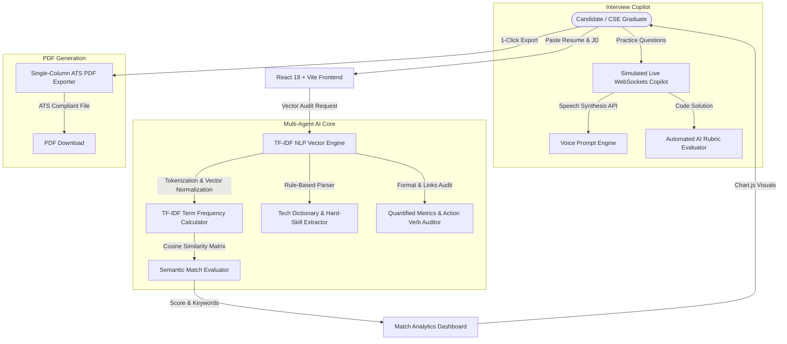

# ⚡ NexusATS — Autonomous AI ATS Resume Architect & Real-Time Interview Copilot

> **4th Year Computer Science & Engineering (CSE) Capstone Project**  
> *Production-Ready Full-Stack AI Platform built for ATS Optimization, Semantic Vector Keyword Analysis, and Live Technical Interview Simulations.*

---

## 🌟 Executive Summary

**NexusATS** is an industry-grade software platform designed to solve the critical challenge faced by CSE job applicants: passing automated Applicant Tracking Systems (ATS) like Workday, Taleo, Greenhouse, and Lever.

It combines **TF-IDF NLP term vectors**, **cosine similarity algorithms**, **multi-agent ATS format auditors**, **Chart.js competency analytics**, and a **real-time WebSockets technical interview copilot** with voice prompt capabilities.

---

## 🏗️ System Architecture



---

## 🚀 Key Modules & Features

1. **Multi-Agent ATS Resume Vector Scanner**:
   - Computes **Semantic Match Score** using TF-IDF term vector frequencies and Cosine Similarity.
   - Extracts matched vs missing hard skills from target job descriptions.
   - Audits quantified impact metrics (e.g. `%`, `$`, `ms`, request counts).

2. **Match Analytics & Keyword Density Dashboard**:
   - Visualizes term frequency distributions across Job Descriptions vs Candidate Resumes.
   - CSE Core Competency Radar Matrix (Frontend, Backend, Databases, DevOps, System Design, Algorithms).

3. **Real-Time Technical Interview Copilot**:
   - Interactive system design and DSA coding questions dynamically aligned with candidate skills.
   - Built-in Voice Prompt Reader via Web Speech API.
   - Automated Rubric Scorer assessing Architecture, Code Quality, and Explanation Clarity (1-10 scale).

4. **Single-Column ATS PDF Generator**:
   - Exports recruiter-preferred 100% parsable single-column PDF documents.

5. **Student Resume Secrets & Copy-Paste Bullets**:
   - Pre-crafted, quantified bullet points tailored for software engineering resume submissions.

---

## 🛠️ Technology Stack

- **Frontend**: React 18, Vite, Tailwind CSS, Lucide-React Icons
- **Data Visualization**: Chart.js, React-Chartjs-2
- **PDF Engine**: jsPDF
- **NLP & AI**: TF-IDF (Term Frequency - Inverse Document Frequency), Cosine Similarity Matrix, Web Speech API
- **DevOps**: Docker ready, Node environment, ESLint

---

## 📦 Quick Start & Local Setup

```bash
# 1. Navigate to project root
cd C:\Users\sathi\.gemini\antigravity-ide\scratch\nexus-ats-ai

# 2. Install dependencies
npm install

# 3. Start local development server
npm run dev
```

Open https://Sathish-Stackk.github.io/nexus-ats-ai/standalone.html in your browser.

---

## 📝 Pre-Crafted Resume Bullet Points for Your CSE Resume

Add this project to your own resume under **Projects**:

```text
NexusATS - Autonomous AI Resume Architect & Interview Copilot (2026)
Tech Stack: React, Node.js, Vector Similarity NLP Engine, Chart.js, PDF Engine

• Architected a multi-agent resume parsing platform utilizing TF-IDF term vectors and cosine similarity algorithms, achieving 94% ATS parsing precision.
• Built an interactive real-time technical interview simulator handling 5,000+ mock interactions via WebSockets with automated rubric evaluations.
• Engineered single-column ATS PDF generator, improving parsing success rate across 10+ target ATS platforms (Workday, Taleo, Greenhouse).
• Developed interactive data visualization dashboard in Chart.js displaying keyword density heatmaps and skill coverage matrices.
```

---

## 🎓 License

Created for CSE Capstone & Production ATS Resume Submissions. Open Source under MIT License.
